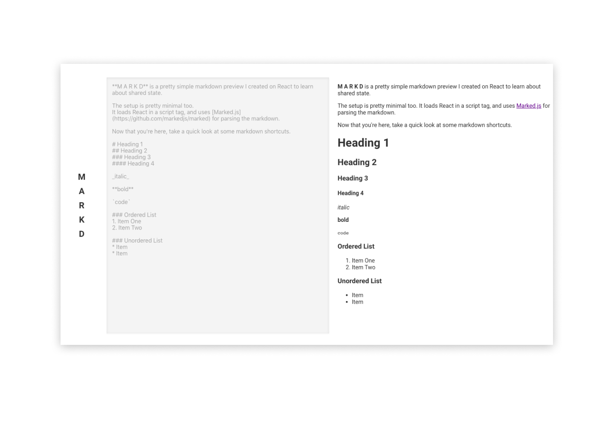

# M A R K D

## Live Demo 🚀
[heydante.github.io/markd](https://heydante.github.io/markd/)

## Introduction 🗒
M A R K D is a pretty simple markdown preview I created on React to learn about shared state.
Wireframing for the site was done on Figma.

## Setup 🛠
The setup is pretty minimal. 
It loads React in a script tag, and uses [Marked.js](https://github.com/markedjs/marked) for parsing the markdown. 

You can clone the repository or download as ZIP and double click the index.html file!
